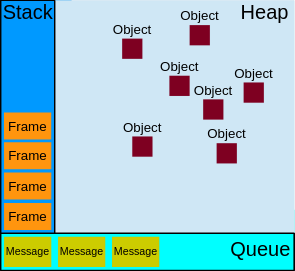

# Les call stacks ?

## « Pile d'exécution »

Javascript est un langage dit "single thread" ce qui signifie qu'il ne peut gérer qu'une seule tâĉhe à la fois ou un morceau 
de code. On ne peut faire qu'une seule chose à la fois. On dit donc qu'il n'a qu'une pile d'exécution,
autrement dit : un seul call stack, le tout correspond donc à un modèle qu'on nomme « Javascript Concurrency Model », 
implémenté depuis dans le moteur [V8](https://v8.dev/).

### Pourquoi ?  

Pour mieux comprendre regardons cette image :  

  

Explications :  

```javascript
function foo(b){
  var a = 5;
  return a * b + 10;
}

function bar(x){
  var y = 3;
  return foo(x * y);
}

console.log(bar(6)); // l'output sera de ?
```  

En exécutant ce code on va regarde en premier la fonction principale, là où tout commence. On démarre donc depuis :  
```javascript
console.log(bar(6));
```
Qui est ensuite poussée dans la stack (pile), la frame suivante (cadre) est donc la fonction **bar** et ses arguments qui à 
son tour appelle la function **foo** qui est encore remise tout en haut de la stack et puisque son return est immédiat 
elle est finalement ejectée de la stack. Après coup **bar** est ejectée (popped out) également pour finalement obtenir
notre console.log qui va print l'output.

#### Visualiser la stack  

Vous avez certainement déjà vu cette longue erreur rouge (stack trace). Cette erreur indique l'état actuel de la call
stack et indique où la function a échoué du haut vers le bas, tout comme la stack finalement. Pour visualiser ça,
exécuter le html et cliquer sur le bouton.  

Parfois on obtient une boucle infinie quand on appelle les functions de façon récursive. Il existe une limite à la
stack. Pour Chrome par exemple elle est de 16 000 frames. Ajoutez plus de stack et Chrome se chargera lui-même de tout 
kill à votre place.

## Le tas (Heap)  

Les objets sont alloués à un tas (heap), c'est une région non structurée de la mémoire. Toutes les allocations de
variables et d'objets se font à cet endroit (lire la doc V8 pour + d'infos).
