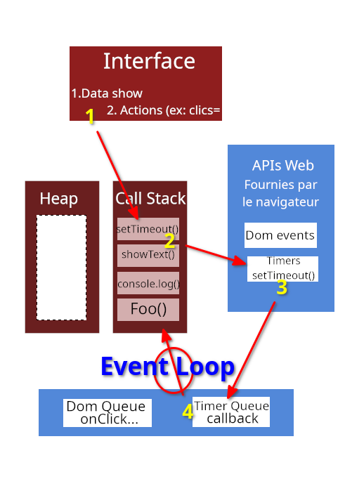

# Event loop (boucle d'événement)

Quand on effectue une évaluation des performances de notre code, par exemple avec un simple console.log. On remarque
que son exécution est rapide, ne bloque pas le thread. Par contre si on se met à loguer par exemple l'exécution de
milliers ou millions de lignes (avec for ou même while) alors là la stack va être rapidement pleine. C'est ce qu'on 
nomme blocking script.

## Comment pallier à ça ?  

La solution la plus simple est d'utiliser des callbacks asynchrones. Une partie du code qu'on exécute et à laquelle on
rajoute donc un callback (fonction) qu'on exécutera plus tard. Cela peut être setTimeout(), setInterval(), un Promise,
etc... Tous ces (async) callbacks ne sont pas exécutés immédiatement, on ne peut alors pas directement les ajouter à la 
stack au contraire des functions synchrones comme console.log par ex.

  

Exemple avec une Promise et fetch() :

```javascript
// Promise
fetch(url)
  .then(res => {
    return res.json();
  })
  .then(data => {
    console.log(data);
  });// async & await
const res = await fetch(url);
const data = await res.json();
console.log(data);
```

Avec une requête comme celle-ci, exécutée par exemple par le clic d'un bouton, voici ce qu'il se passe :  

- La requête est exécutée puis elle est traitée par le navigateur et les web apis ;
- Si la stack le permet et que la Promise est fulfilled alors le callback est exécutée et le résultat peut-être affiché.  

Le rôle de l'event loop est de vérifier à la fois l'état de la stack et de la queue pour y insérer la première chose
disponible dans la queue vers la stack, **quand la stack est vide**. En effet les WEB APIs ne peuvent pas d'elles-mêmes
push des éléments dans la stack car si c'était le cas alors du contenu pourrait potentiellement apparaître n'importe où
dans le code.


### Regular event loop  


Illustration complémentaire pour un peu plus de clarté, avec un setTimeout() :

  

Pour déterminer s'il est possible d'ajouter des éléments à la stack, l'event loop envoie des ticks à la stack.

> Rappel :  
> L'agument passé à setTimout() n'est pas une valeur sûre. Cet argument correspond davantage au délai minimum mais pas
> à un délai **garanti**. Par exemple setTimeout(maFonction(),100); indique uniquement que maFonction sera lancé au moins 
> après 100 millisecondes.