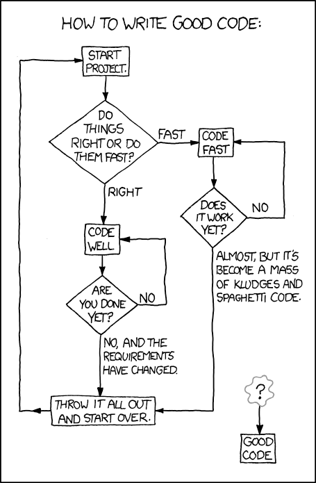

# Un code propre

Écrire du code propre est essentiel pour assurer la maintenance et la lisibilité de votre code. Cela permettra à 
d'autres développeurs de comprendre votre code et de le modifier facilement. Il est donc important de prendre le temps 
de réfléchir à la structure de votre code et de l'écrire de manière à ce qu'il soit facilement compréhensible.  



## Les principes de base

### 1. Utilisez des noms de variables et de fonctions explicites :

```javascript
// Mauvais
const yyyymmdstr = new Date().toISOString().slice(0, 10);
// Bon
const currentDate = new Date().toISOString().slice(0, 10);
```

### 2. Utiliser les mêmes noms de variables pour le même type de variable :

```javascript
// Mauvais
getUserInfo();
getClientData();
getCustomerRecord();
// Bon
getUser();
```

### 3. Utilisez des noms de variables qui ont du sens, facile à comprendre :

```javascript
// Je ne sais pas ce que cette fonction fait
function qqq() {
  // ...
}
// Je sais ce que cette fonction fait
function getUser() {
  // ...
}
```

### 4. Utilisez des variables explicites :

```javascript
// Mauvais
const u = getUser();
const s = getSubscription();
const t = charge(u, s);
// Bon
const user = getUser();
const subscription = getSubscription();
const transaction = charge(user, subscription);
```

### 5. Pas de mental mapping :

```javascript
// Mauvais
const locations = ["Austin", "New York", "San Francisco"];
locations.forEach(l => {
  doStuff();
  doSomeOtherStuff();
  // ...
  // ...
  // ...
  // À quoi correspond `l` ?
  dispatch(l);
});
// Bon
const locations = ["Austin", "New York", "San Francisco"];
locations.forEach(location => {
  doStuff();
  doSomeOtherStuff();
  // ...
  // ...
  // ...
  dispatch(location);
});
```

### 6. Respectez la convention de nommage (camelCase) :

```javascript
// Mauvais
function create_user() {
  // ...
}
// Bon
function createUser() {
  // ...
}
```

### 7. Les fonctions doivent réaliser une seule tâche :

```javascript
// Mauvais
function invitationsFriends(friends) {
  friends.forEach(friend => {
    const friendRecord = database.lookup(friend);
    if (friendRecord.isEligible) {
      email(friend);
    }
    });
}
// Bon
function emailEligibleFriends(friends) {
  friends.filter(isEligible).forEach(email);
}

function isEligible(friend) {
  const friendRecord = database.lookup(friend);
  return friendRecord.isEligible;
}
```

### 8. Installer un linter :

Un linter est un outil qui permet de vérifier la qualité du code. Il permet de détecter les erreurs et potentiellement
les bugs. Il est donc important de l'installer et de le configurer pour votre projet. Plusieurs linters existent,
plusieurs règles également. Il est donc important de choisir un linter et des règles qui correspondent à votre projet.